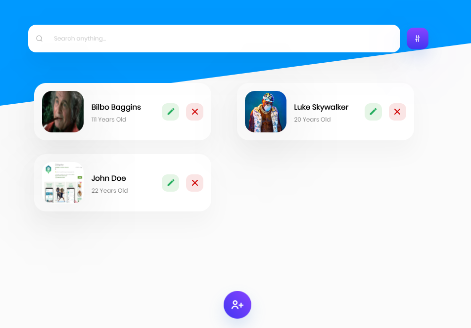
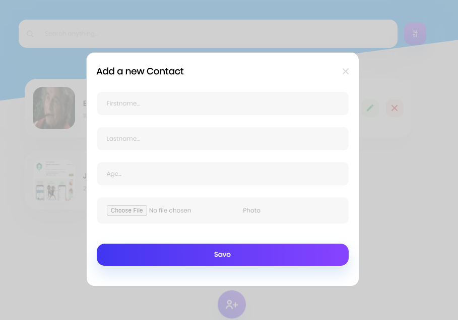
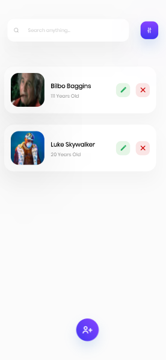
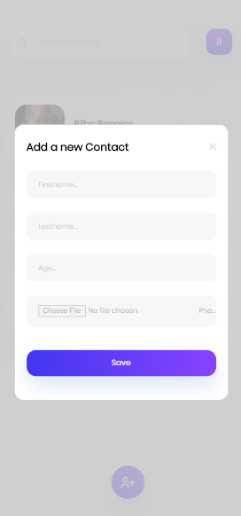

## Contact App
http://simple-crud-contact.surge.sh/

Simple CRUD Contact App using API https://simple-contact-crud.herokuapp.com/documentation

## `Feature`
- Serach Contact By Firstname, Lastname, Age and also ID
- CRUD ( Create, Update and Delete )
- Responsive Design

## `Used`
- git clone https://github.com/MochIsrin068/Simple-contact-app.git
- npm install
- npm start
  
## `Screen`

### `Desktop : `

### `Mobile : `

